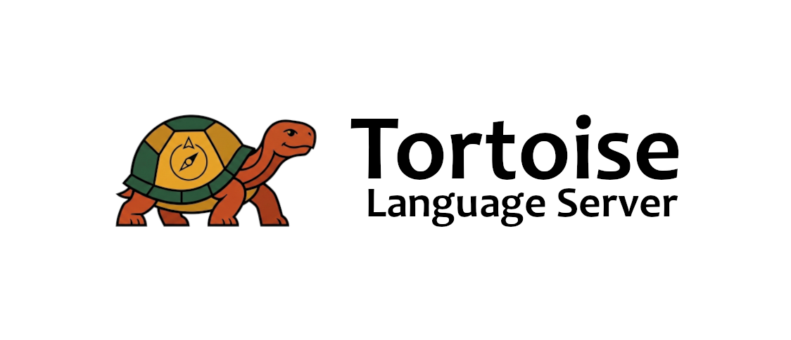
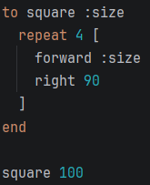
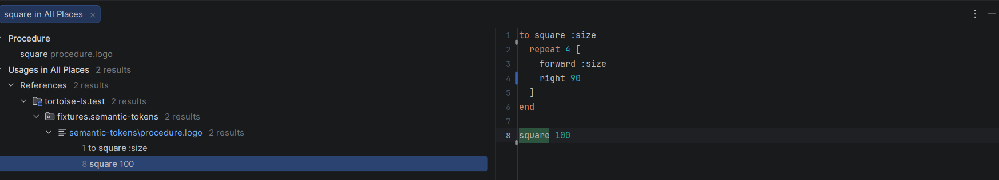
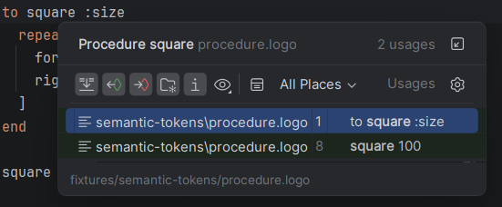
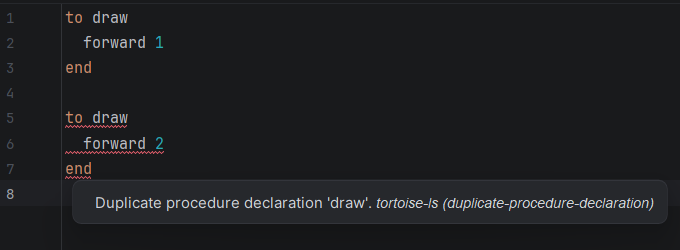
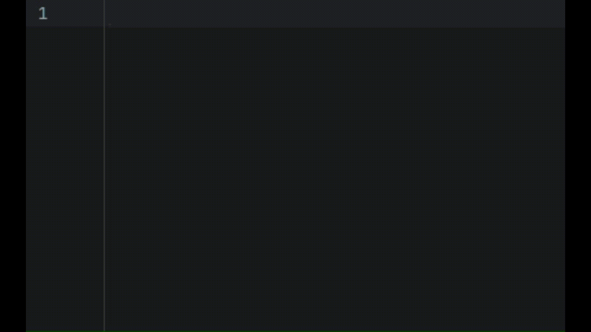
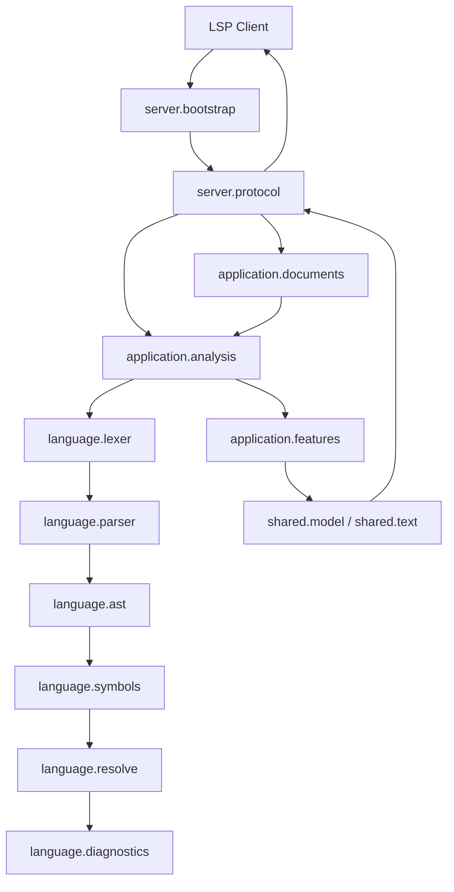

# Tortoise

---



---

Tortoise Language Server is a Kotlin implementation of the Language Server Protocol for the Turtle Academy LOGO dialect. It provides editor features for `.logo` files through LSP4J over stdio, with IntelliJ IDEA plus the LSP4IJ plugin as the primary client.

The project is intentionally scoped as a single-file language server. Every editor feature is built on the same semantic pipeline: lexing, tolerant parsing, AST construction, symbol collection, scope resolution, diagnostics, and protocol mapping.

## Table of Contents

- [Project Status](#project-status)
- [Prerequisites](#prerequisites)
- [Build And Run](#build-and-run)
- [Connect To An LSP Client](#connect-to-an-lsp-client)
- [Usage](#usage)
- [Supported Language Subset](#supported-language-subset)
- [Features](#features)
- [Architecture](#architecture)
- [Project Layout](#project-layout)
- [Testing](#testing)
- [Limitations And Non-Goals](#limitations-and-non-goals)
- [License](#license)

## Project Status

This repository contains the core LSP implementation for a focused Turtle Academy LOGO tooling project. The current feature set is deliberately small and reviewable:

1. Semantic tokens
2. Go-to-declaration
3. References
4. Diagnostics
5. Completion

The server does not try to become a full LOGO IDE. It favors correctness, deterministic behavior, clear package boundaries, and a semantic core that can be defended during code review.

## Prerequisites

Before building or running the server, install:

- JDK 17 or newer. The Gradle build uses the Kotlin JVM toolchain set to Java 17.
- A JetBrains IDE for the documented client setup, such as IntelliJ IDEA.
- The LSP4IJ plugin from the [JetBrains Marketplace](https://plugins.jetbrains.com/plugin/23257-lsp4ij).

The Gradle wrapper is included, so a separate Gradle installation is not required.

## Build And Run

### Build The Project

From the project root run:

- Windows:

  ```bat
  .\gradlew.bat build
  ```

- macOS/Linux:

  ```bash
  ./gradlew build
  ```

### Build The Server Launcher

`installDist` creates a runnable distribution under `build/install/tortoise-ls`.

- Windows:

  ```bat
  .\gradlew.bat installDist
  ```

- macOS/Linux:

  ```bash
  ./gradlew installDist
  ```

### Run The Server Manually

For quick local checks, the application plugin can run the server directly:

- Windows:

  ```bat
  .\gradlew.bat run
  ```

- macOS/Linux:

  ```bash
  ./gradlew run
  ```

For an editor client, prefer the generated launcher from `installDist`:

- Windows:

  ```bat
  build\install\tortoise-ls\bin\tortoise-ls.bat
  ```

- macOS/Linux:

  ```bash
  ./build/install/tortoise-ls/bin/tortoise-ls
  ```

The server uses stdio transport. When started by an LSP client, the client owns the process and communicates with it over standard input and output.

## Connect To An LSP Client

Any LSP-compatible client can start the server as a stdio process. The documented path is IntelliJ IDEA with LSP4IJ.

For the general LSP4IJ user-defined language server flow, see the official [User-defined language server documentation](https://github.com/redhat-developer/lsp4ij/blob/main/docs/UserDefinedLanguageServer.md).

### Configure Tortoise Language Server In IntelliJ

First run `installDist`, then open:

`Settings > Languages & Frameworks > Language Servers`

Create a new user-defined language server with the following values.

#### Server

- Name: `tortoise-ls`
- Command:
  - Windows: absolute path to `tortoise-ls\build\install\tortoise-ls\bin\tortoise-ls.bat`
  - macOS/Linux: absolute path to `tortoise-ls/build/install/tortoise-ls/bin/tortoise-ls`

#### Mappings

Add one file name pattern mapping:

- File name pattern: `*.logo`
- Language ID: `logo`

Leave the other fields empty unless explicit server configuration is added later.

### Expected IntelliJ Result

After the mapping is active, opening a `.logo` file should start the language server automatically. In the editor, supported LOGO files should expose semantic token information, diagnostics in the editor/problems view, completion suggestions, and navigation actions such as go-to-declaration and find references for supported symbols.

The exact colors are controlled by IntelliJ, LSP4IJ, and the active theme. For example, several semantic token categories may appear with the same color, and some built-ins may not receive a visibly distinct style even though the server classifies them.

### IntelliJ Spellchecking

IntelliJ's spelling inspection is separate from LSP diagnostics and semantic tokens. The server classifies LOGO words such as `localmake` as keywords, but an LSP4IJ user-defined language server does not provide IntelliJ with a LOGO-specific PSI tree or `SpellcheckingStrategy`. As a result, IntelliJ can still underline LOGO keywords or built-ins as typos.

There are two practical workarounds:

1. Add `docs/intellij-logo-dictionary.dic` under `Settings > Editor > Natural Languages > Spelling` so IntelliJ accepts Turtle Academy LOGO keywords and built-ins.
2. Create an inspection scope for `*.logo` files and lower or disable `Settings > Editor > Inspections > Proofreading > Spelling` for that scope.

JetBrains' plugin API handles the product-grade version of this through a custom language plugin that registers a `SpellcheckingStrategy` and returns `EMPTY_TOKENIZER` for non-natural-language PSI elements such as keywords, built-ins, punctuation, and numbers. That is outside this repository's current LSP-only scope.

## Usage

Open a file with the `.logo` extension in IntelliJ IDEA after configuring LSP4IJ.

Example program:

```logo
to square :size
  repeat 4 [
    forward :size
    right 90
  ]
end

square 100
```

With the language server connected:

- Keywords such as `to`, `repeat`, and `end` are sent as semantic keyword tokens.
- Built-ins such as `forward` and `right` are classified as built-in procedures by the server. Depending on the IntelliJ theme, they may share a color with other token types or may not look visually distinct.
- `square` is recognized as a user procedure declaration and call.
- `:size` resolves to the procedure parameter.
- Go-to-declaration from `square 100` navigates to `to square :size`.
- Find references on `square` returns semantic procedure references in the same file. Depending on the client's "include declaration" setting, the declaration line can appear in the references result as well as being the go-to-declaration target.
- Completion suggests built-ins, user procedures, and visible variables based on cursor position.

### Feature Examples

Semantic tokens highlight LOGO keywords, built-ins, user procedures, parameters, and variables in the editor.



Go-to-declaration jumps from supported calls and variable references to their same-file declarations.



Find references returns semantic references for the selected procedure or variable binding.



Diagnostics appear in the editor and problems view after document open or change.



Completion suggests built-ins, user procedures, parameters, and visible variables based on cursor position.



## Supported Language Subset

The server targets a practical subset of the Turtle Academy LOGO dialect. Detailed language assumptions live in [docs/turtle-logo-semantics.md](docs/turtle-logo-semantics.md).

Supported constructs include:

- Procedure declarations using `to ... end` and supported `define` forms.
- Procedure calls for user-defined and built-in procedures.
- Parameters written as `:name`.
- Variable writes through `make`, `localmake`, and `name`.
- Variable reads through `:name` and supported `thing "name` forms.
- Bracketed blocks and lists.
- Control structures such as `repeat`, `for`, `if`, `ifelse`, `dotimes`, `while`, and `until`.
- Basic expressions including numbers, words, identifiers, variable references, lists, parentheses, and supported binary operators.

Important semantic assumptions:

- The analysis unit is one document.
- Procedure declarations are file-level symbols.
- Parameters are procedure-local.
- `localmake` defines a local variable in the current scope.
- `make` and `name` follow one consistent resolver rule for new bindings.
- `:name` resolves to the nearest visible variable or parameter.
- Built-ins are always available and are not user declarations.
- References are same-file only.

## Features

Feature work is driven by a cached `DocumentAnalysis` per document version (`CachedAnalysisService`: parse, resolve, diagnostics). LSP positions are mapped to lexer tokens via the `DocumentAnalysis` extensions in `LogoFeatureTokenLookup` (`tokenAt`, `procedureNameSpan`, `tokenAtStartOffset`).

### Semantic Tokens

**What:** Syntax highlighting for keywords, literals, built-in calls, user procedures, parameters, and variables via LSP semantic tokens rather than naive text rules.

**How:**

- **Request:** `textDocument/semanticTokens/full` in `TortoiseTextDocumentService.semanticTokensFull`.
- **Core:** `LogoSemanticTokensService` walks lexer tokens from `DocumentAnalysis.parseResult` and joins resolution data (`procedureReferences`, `variableReferences`, `variableDeclarations`) to assign `LogoSemanticTokenType` per token.
- **Protocol:** `SemanticTokensProtocolMapper` produces LSP delta arrays; the legend is advertised in `ServerCapabilityFactory` from `LogoSemanticTokenType`. Token modifiers are always zero.

### Go-To-Declaration

**What:** Jump from a call or variable use to the declaring procedure name or variable binding in the same file. Built-in procedures have no declaration target.

**How:**

- **Request:** `textDocument/definition` in `TortoiseTextDocumentService.definition`.
- **Core:** `LogoDefinitionService` uses `tokenAt` and `LogoTokenType`: `IDENTIFIER` resolves via `procedureReferences` to a non-built-in declaration and returns the procedure name span when possible (`procedureNameSpan`); `VARIABLE_REFERENCE` and `WORD_LITERAL` resolve via `variableReferences` to `declaration.declarationSpan`.
- **Protocol:** returns a single `Location` for the same document URI.

### References

**What:** Find all uses of a user procedure or variable that share the same semantic binding; not plain-text search.

**How:**

- **Request:** `textDocument/references` in `TortoiseTextDocumentService.references`, including `ReferenceParams.context.includeDeclaration`.
- **Core:** `LogoReferenceService` keeps references that share the **same declaration object** (`procedureReferences` / `variableReferences` filtered by declaration). Built-in call sites have no declaration, so find-references does not apply there. The procedure name in a header can resolve the declaration for the query.
- **Protocol:** each hit is a `Location` with the same URI.

### Diagnostics

**What:** Issues reported as LSP diagnostics in the editor and problems view after open or change.

**How:**

- **Push:** `didOpen`, `didChange`, and `didClose` in `TortoiseTextDocumentService`; `TortoiseLanguageServer.publishDiagnostics` sends `textDocument/publishDiagnostics` with `source` `tortoise-ls`.
- **Core:** `LogoDiagnosticsService.computeDiagnostics` covers unresolved procedures and variables, duplicate procedure declarations (`procedureTable`), and a **filtered** subset of `parseResult.errors` (malformed procedure declaration messages only).
- **Protocol:** ranges and messages come from `LogoDiagnostic`.

### Completion

**What:** Suggestions for built-ins, user procedures, and in-scope parameters and variables as `:` names, filtered by the typed prefix.

**How:**

- **Request:** `textDocument/completion` in `TortoiseTextDocumentService.completion`.
- **Core:** `LogoCompletionService` and `LogoCompletionEngine` derive prefix and replace span, visible scopes, built-ins (excluding names shadowed by user procedures), user procedures, parameters, and variables with deterministic ordering (`sortText`, `distinctBy`).
- **Protocol:** `toLspCompletionItem` uses `CompletionItem.textEdit` as a `TextEdit` over the replace span.

## Architecture

The implementation is layered so that LSP protocol code stays separate from LOGO language semantics. The language core does not import LSP4J; protocol handlers convert between LSP4J types and internal, protocol-neutral models.



### Runtime Flow

1. `StdioServerBootstrap` starts `TortoiseLanguageServer` through LSP4J using standard input and output.
2. `TortoiseLanguageServer` advertises server capabilities: full text synchronization, semantic tokens, definitions, references, and completion.
3. `TortoiseTextDocumentService` receives LSP events and requests.
4. On `didOpen` and `didChange`, `InMemoryDocumentStore` stores a `DocumentSnapshot`. The current synchronization strategy is full-text replacement through `FullTextSyncStrategy`.
5. `CachedAnalysisService` analyzes the latest snapshot. It parses the text, resolves symbols and scopes, computes diagnostics, and caches the result by document URI and version.
6. Feature requests reuse the cached `DocumentAnalysis` instead of reparsing independently.
7. Protocol mappers convert internal spans, diagnostics, semantic tokens, and completion items back into LSP4J response types.

## Project Layout

```text
.
|-- README.md
|-- build.gradle.kts
|-- settings.gradle.kts
|-- docs/
|   |-- implementation-plan.md
|   |-- resources/
|   `-- turtle-logo-semantics.md
|-- gradle/
|-- src/
|   |-- main/
|   |   `-- kotlin/dev/tortoise/
|   |       |-- server/
|   |       |-- application/
|   |       |-- language/
|   |       `-- shared/
|   `-- test/
|       |-- kotlin/dev/tortoise/
|       `-- resources/fixtures/
`-- gradlew / gradlew.bat
```

Key areas:

| Path | Responsibility |
| --- | --- |
| `server.bootstrap` | Starts the stdio LSP server process. |
| `server.protocol` | Owns LSP4J handlers, capabilities, lifecycle, and protocol mapping. |
| `application.documents` | Tracks open documents and applies full text synchronization. |
| `application.analysis` | Orchestrates parse, resolve, diagnostics, and versioned analysis caching. |
| `application.features` | Exposes editor-facing services for semantic tokens, definition, references, and completion. |
| `language.lexer` | Tokenizes Turtle Academy LOGO source text. |
| `language.parser` | Builds a tolerant parse result and AST from tokens. |
| `language.ast` | Defines the protocol-neutral LOGO syntax tree. |
| `language.symbols` | Collects procedure declarations and duplicate declarations. |
| `language.resolve` | Builds scopes, binds procedure and variable references, and identifies unresolved symbols. |
| `language.diagnostics` | Converts parse and resolution problems into internal diagnostics. |
| `language.completion` | Computes deterministic completion candidates from semantic state. |
| `shared.text` | Stores source positions and spans used across layers. |
| `shared.model` | Stores protocol-neutral diagnostics, semantic tokens, and completion models. |
| `docs/resources` | Images and GIFs used in this README to illustrate shipped features. |
| `src/test/resources/fixtures` | Golden fixtures for lexer, diagnostics, semantic tokens, and references. |

## Testing

### Run Tests

From the project root run:

- Windows:

  ```bat
  .\gradlew.bat test
  ```

- macOS/Linux:

  ```bash
  ./gradlew test
  ```

### Test Strategy

The tests focus on the semantic core and LSP-facing behavior:

- Lexer tests and golden token fixtures check stable tokenization.
- Parser tests check supported syntax and malformed input recovery.
- Resolver tests check procedure, parameter, variable, loop, and built-in binding behavior.
- Diagnostics golden tests check user-facing error output.
- Semantic token golden tests check syntax-highlighting classification.
- Definition and reference tests check navigation based on semantic bindings.
- Completion tests check deterministic suggestions from built-ins, user procedures, and visible variables.
- A language server smoke test checks initialization and protocol-level behavior.

This is important because the editor features are not independent implementations. They all depend on the same parse and resolution result, so tests around the language core protect multiple LSP features at once.

## Limitations And Non-Goals

The server intentionally excludes:

- Cross-file resolution.
- Workspace indexing.
- Rename support.
- Formatting support.
- Workspace symbols.
- Broad LOGO dialect coverage beyond the documented Turtle Academy subset.
- Extra editor features that are not part of the shipped feature set.

Known modeling boundaries:

- Analysis is single-document only.
- Semantic features depend on the latest opened or changed document version cached by the server.
- Built-in procedures come from a static catalog.
- The parser is tolerant and useful for editor feedback, but it is not a full Turtle Academy interpreter.
- The server does not execute LOGO programs.

## License

This project is licensed under the MIT License. See [LICENSE](LICENSE).
